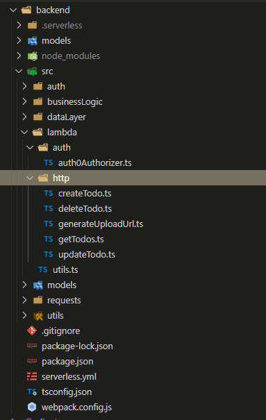
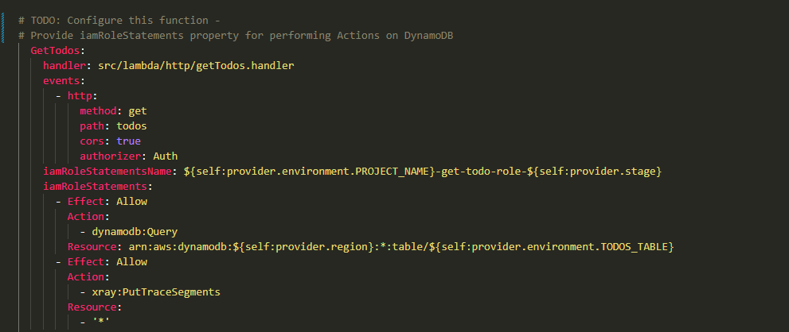
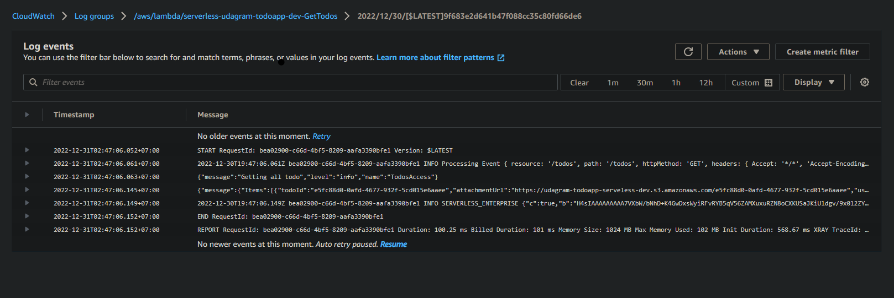
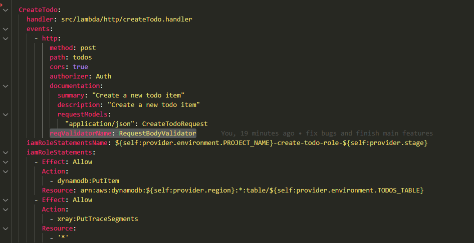
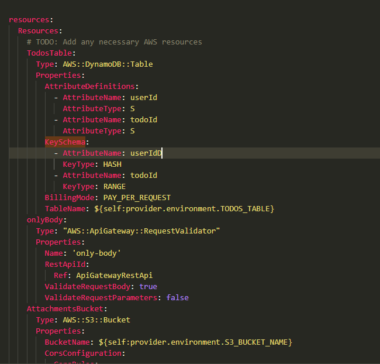
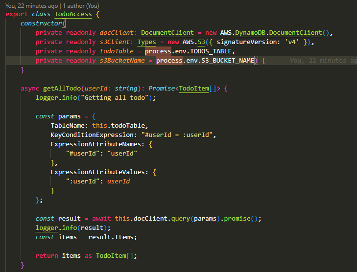

# Note for reviewer (follow rubics)

This README.md file may save you time to review especially this is nearly New Year's Eve. Happy New Year!!!

_Note:_ To run client (frontend), you only need to run the following command:

```bash

# Go to client folder (if your terminal in right here direction)
cd ../client/

# Install dependents
npm i

# Run frontend project
npm run start

```

# I. Functionality

These requirements are implements by the pr

1. The application allows users to create, update, delete TODO items: A user of the web application can use the interface to create, delete and complete a TODO item.

2. The application allows users to upload a file: A user of the web interface can click on a "pencil" button, then select and upload a file. A file should appear in the list of TODO items on the home page.

3. The application only displays TODO items for a logged in user: If you log out from a current user and log in as a different user, the application should not show TODO items created by the first account.

4. Authentication is implemented and does not allow unauthenticated access: A user needs to authenticate in order to use an application.

# II. Code Base

1. The code is split into multiple layers separating business logic from I/O related code: Code of Lambda functions is split into multiple files/classes. The business logic of an application is separated from code for database access, file storage, and code related to AWS Lambda.



separated in code base


separated in lamda

2. Code is implemented using async/await and Promises without using callbacks. To get results of asynchronous operations, a student is using async/await constructs instead of passing callbacks.


# III. Best Practices

1. All resources in the application are defined in the "serverless.yml" file: All resources needed by an application are defined in the "serverless.yml". A developer does not need to create them manually using AWS console.

That's right. I only defined all resources of this application in [the "serverless.yml" file](../backend/serverless.yml)


2. Each function has its own set of permissions. Instead of defining all permissions under provider/iamRoleStatements, permissions are defined per function in the functions section of the "serverless.yml".



3. Application has sufficient monitoring. Application has at least some of the following:

- Distributed tracing is enabled
- It has a sufficient amount of log statements
- It generates application level metrics




4. HTTP requests are validated. Incoming HTTP requests are validated either in Lambda handlers or using request validation in API Gateway. The latter can be done either using the serverless-reqvalidator-plugin or by providing request schemas in function definitions.


import serverless-reqvalidator-plugin



# IV. Best Practices

1. Data is stored in a table with a composite key. 1:M (1 to many) relationship between users and TODO items is modeled using a DynamoDB table that has a composite key with both partition and sort keys. Should be defined similar to this:

```
    KeySchema:
        - AttributeName: partitionKey
            KeyType: HASH
        - AttributeName: sortKey
            KeyType: RANGE
```



2. Scan operation is not used to read data from a database. TODO items are fetched using the "query()" method and not "scan()" method (which is less efficient on large datasets)


